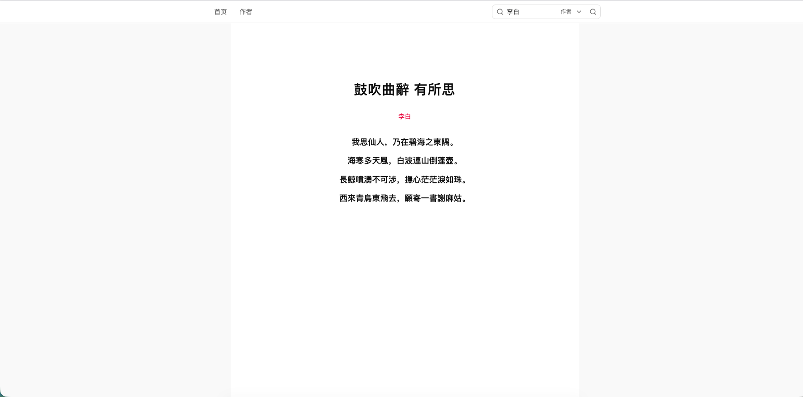
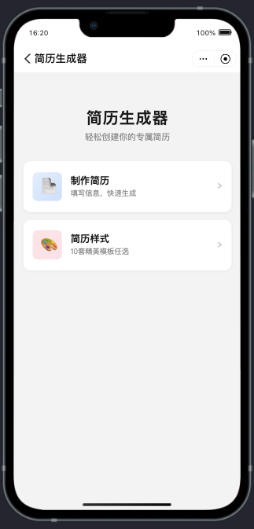
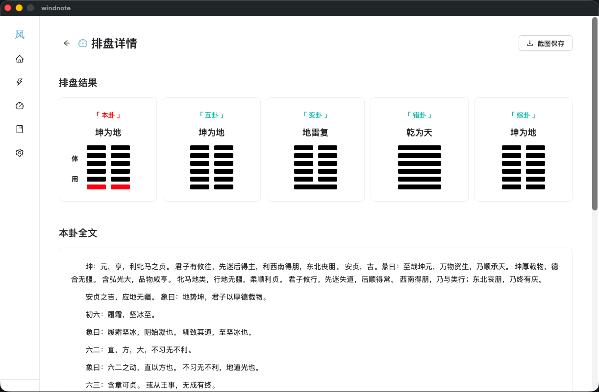

  

---

# 风起 · 风之思

遇事不决问东风，风起之时见真章。

---

## 项目一览

| 项目 | 描述 | 技术栈 | 链接 |
|------|------|--------|------|
| 风起 · 诗词 | 在线诗词鉴赏平台 | Next.js, TypeScript, Tailwind CSS | [windstart.top](https://windstart.top) |
| Wind Resume | 支付宝小程序简历生成器 | TypeScript, 支付宝小程序, Less | [GitHub](https://github.com/fengzhongsikao/windResume) |
| 风筮 · Windnote | 易经占卜桌面应用 | Go, React, Wails | [GitHub](https://github.com/fengzhongsikao/windnote) |

---

## 风起 · 诗词

> **在线体验：** [windstart.top](https://windstart.top)
>
> **项目地址：** [github.com/fengzhongsikao/feng-qi](https://github.com/fengzhongsikao/feng-qi)

随机推荐一首诗，感受千年风雅。

### 功能特性

- **随机诗词** — 首页随机展示一首唐诗宋词
- **搜索诗词** — 支持按标题、作者、正文关键词搜索
- **作者浏览** — 按作者浏览诗词
- **诗词详情** — 查看诗词完整内容

### 技术栈

Next.js 16 · React 19 · TypeScript · Tailwind CSS v4 · shadcn/ui · Lucide

### 截图

---

## Wind Resume · 简历生成器

> **项目地址：** [github.com/fengzhongsikao/windResume](https://github.com/fengzhongsikao/windResume)

一款在支付宝小程序端运行的简历制作工具，提供丰富的模板和模块化编辑能力，支持导出 PDF。

### 功能特性

- **模块化编辑** — 支持求职意向、教育经历、实习经历、工作经历、项目经历、技能特长、兴趣爱好、自我评价等 8 种模块，自由组合
- **10 套精美模板** — 涵盖经典蓝、简约白、商务黑、优雅紫、清新绿、暖橙、科技灰、文艺风、极简风、双栏布局等多种风格
- **PDF 导出** — 基于 Canvas 渲染简历并生成 PDF，无需第三方库
- **本地存储** — 使用 zustand 管理状态，数据持久化保存在本地

### 技术栈

TypeScript · 支付宝小程序 · Less · antd-mini · zustand

### 截图

| 首页 | 简历详情 |
|------|---------|
|  |  |

---

## 风筮 · Windnote

> **项目地址：** [github.com/fengzhongsikao/windnote](https://github.com/fengzhongsikao/windnote)

风筮是一款基于《易经》的桌面占卜应用，支持**六爻起卦**和**梅花易数**两种传统占卜方法。内置六十四卦解卦库，帮助用户在决策困惑时寻求指引。

心诚则灵，遇事不决问东风。

### 功能特性

- **六爻起卦** — 自动/手动起卦，支持变卦计算，显示纳甲、六亲、六神等传统信息
- **梅花易数** — 数字起卦、手动起卦，体用生克分析
- **解卦库** — 六十四卦完整收录，支持卦名、卦象搜索
- **今日黄历** — 公历、农历、干支、生肖、宜忌、财神方位

### 技术栈

**桌面框架：** Wails v2 · **后端：** Go · **前端：** React 18 · React Router v6 · Ant Design 6 · Zustand · Vite 5 · Tailwind CSS 3 · Framer Motion

### 截图

| 首页 | 六爻详情 | 梅花详情 |
|------|---------|---------|
|  |  |  |

---
