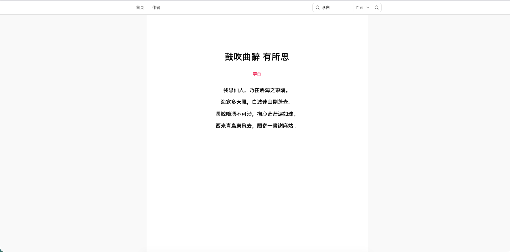
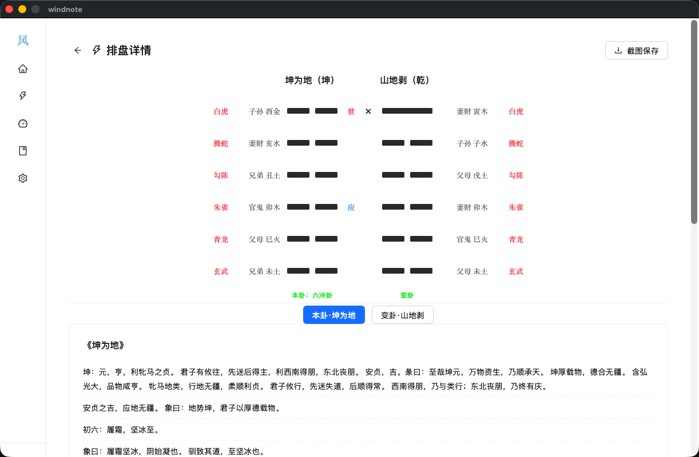
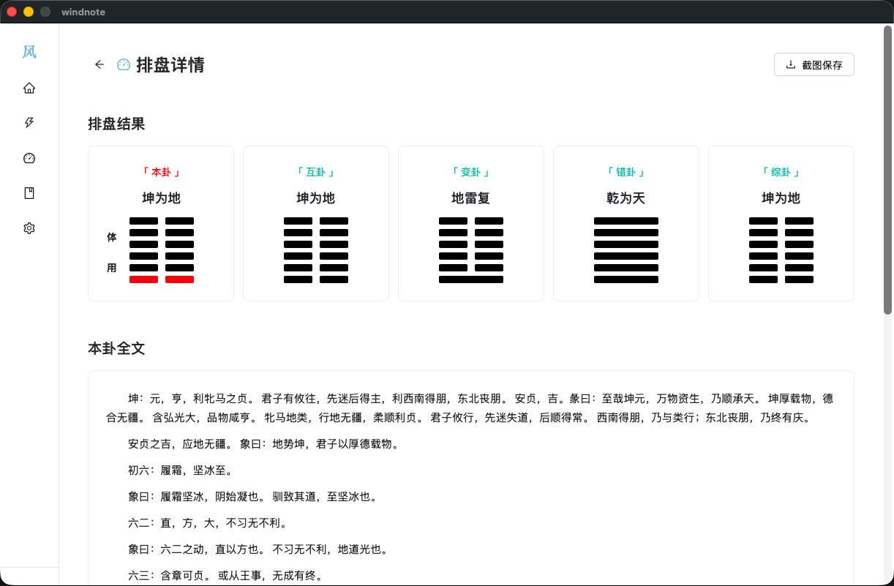

  

---

# 风起 · 风之思

遇事不决问东风，风起之时见真章。

---

## 项目一览

| 项目 | 描述 | 技术栈 | 链接 |
|------|------|--------|------|
| 风起 · 诗词 | 在线诗词鉴赏平台 | Next.js, TypeScript, Tailwind CSS | [windstart.top](https://windstart.top) |
| Windmusic | 跨平台桌面音乐客户端 | Go, Svelte 5, TypeScript, Wails v2 | [GitHub](https://github.com/fengzhongsikao/windmusic) |
| 风筮 · Windnote | 易经占卜桌面应用 | Go, React, Wails | [GitHub](https://github.com/fengzhongsikao/windnote) |
| 风起导航 | 精选网址导航，收录 200+ 优质网站 | TypeScript, Next.js, Tailwind CSS | [windtop.top](https://www.windtop.top) |

---

## 风起 · 诗词

> **在线体验：** [windstart.top](https://windstart.top)
>
> **项目地址：** [github.com/fengzhongsikao/feng-qi](https://github.com/fengzhongsikao/feng-qi)

随机推荐一首诗，感受千年风雅。

### 功能特性

- **随机诗词** — 首页随机展示一首唐诗宋词
- **搜索诗词** — 支持按标题、作者、正文关键词搜索
- **作者浏览** — 按作者浏览诗词
- **诗词详情** — 查看诗词完整内容

### 技术栈

Next.js 16 · React 19 · TypeScript · Tailwind CSS v4 · shadcn/ui · Lucide

### 截图

---

## Windmusic · 桌面音乐客户端

> **项目地址：** [github.com/fengzhongsikao/windmusic](https://github.com/fengzhongsikao/windmusic)
>
> **演示视频：** [B 站](https://www.bilibili.com/video/BV1L8V36bEFW/)

基于 Wails v2 的跨平台桌面音乐客户端，支持在线搜索播放与本地音乐库管理。

### 功能特性

- **首页发现** — 推荐 / 华语 / 流行 / 摇滚 / 电子等分类 Tab，通过 Meting 搜索拉取曲目
- **搜索** — 关键词搜索、分页，顶栏全局搜索框快捷进入
- **沉浸式歌词** — 歌曲详情页频谱可视化 + LRC 歌词同步滚动，点击歌词可跳转
- **本地音乐** — 扫描 MP3/FLAC/M4A 等格式，读取内嵌封面与歌词，SQLite 持久化
- **我喜欢的音乐** — 收藏管理，支持编辑、全选、批量删除
- **歌单系统** — 创建、删除歌单，向歌单添加/移除歌曲，侧边栏快速访问
- **最近播放** — 自动记录播放历史，支持清空与编辑
- **设置** — 配置多个 Meting API 节点，灵活切换数据源

### 技术栈

**桌面框架：** Wails v2 · **后端：** Go · **前端：** Svelte 5 · TypeScript · Vite 8 · Tailwind CSS 4
**JS 运行时：** Bun · **路由：** svelte-spa-router · **持久化：** SQLite（本地库）+ JSON（收藏/歌单/设置）

### 截图

| 首页发现 | 本地音乐 | 最近播放 |
|---------|---------|---------|
|  |  |  |

---

## 风筮 · Windnote

> **项目地址：** [github.com/fengzhongsikao/windnote](https://github.com/fengzhongsikao/windnote)

风筮是一款基于《易经》的桌面占卜应用，支持**六爻起卦**和**梅花易数**两种传统占卜方法。内置六十四卦解卦库，帮助用户在决策困惑时寻求指引。

心诚则灵，遇事不决问东风。

### 功能特性

- **六爻起卦** — 自动/手动起卦，支持变卦计算，显示纳甲、六亲、六神等传统信息
- **梅花易数** — 数字起卦、手动起卦，体用生克分析
- **解卦库** — 六十四卦完整收录，支持卦名、卦象搜索
- **今日黄历** — 公历、农历、干支、生肖、宜忌、财神方位

### 技术栈

**桌面框架：** Wails v2 · **后端：** Go · **前端：** React 18 · React Router v6 · Ant Design 6 · Zustand · Vite 5 · Tailwind CSS 3 · Framer Motion

### 截图

| 首页 | 六爻详情 | 梅花详情 |
|------|---------|---------|
|  |  |  |

---

## 风起导航

> **在线体验：** [windtop.top](https://www.windtop.top)
>
> **项目地址：** [github.com/fengzhongsikao/windnav](https://github.com/fengzhongsikao/windnav)

精选网址导航站，收录 200+ 优质网站资源，涵盖推荐工具、个人博客、导航网站、AI 对话、AI 创作等分类。

### 功能特性

- **推荐网站** — 精选实用工具与平台
- **个人博客** — 收录优质技术博客与个人站点
- **导航网站** — 汇集各类导航资源
- **AI 对话** — ChatGPT、DeepSeek、Kimi 等主流 AI 对话工具
- **AI 创作** — Midjourney、Liblib 等 AI 创作平台

### 技术栈

TypeScript · Next.js · Tailwind CSS

### 截图

---
